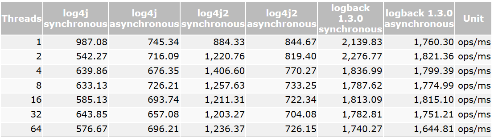
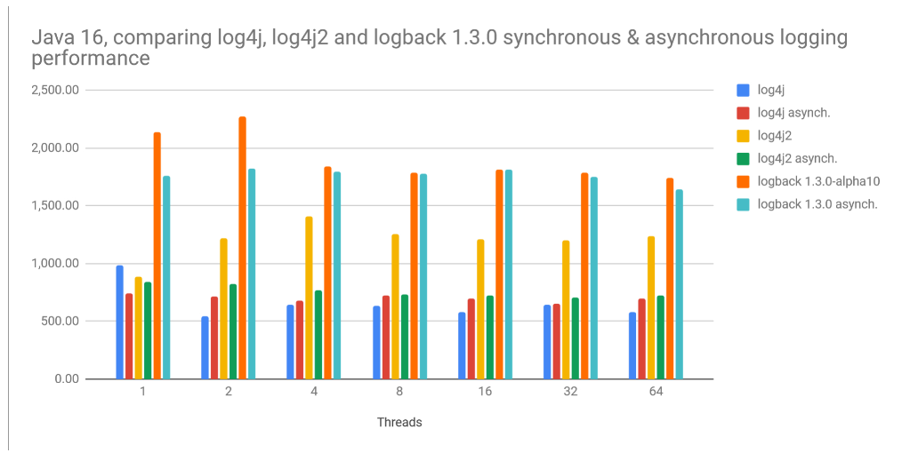

# Logback

## source repository

https://github.com/qos-ch/logback

## synchronous and asynchronous logging

同步 和 异步 日志

Log4j 1.2 as well as logback have supported asynchronous logging for many years by the way of AsyncAppender. This appender essentially collects newly created logging events, as produced by the application, into a circular buffer. The events in this circular buffer are then processed by a dedicated worker thread which writes the events to their destination, be it a file, a remote server or a database.

## logback version

**STABLE version (ACTIVELY DEVELOPED)**

1.3.5 支持 Java EE 需要 SLF4J 2.0.4 和 JDK 8  
The current actively developed version of logback supporting Java EE (java.* namespace) is 1.3.5. It requires SLF4J version 2.0.4 and JDK 8.

1.4.5 支持 Jakarta EE 需要 SLF4J 2.0.4 和 JDK 11  
The current actively developed version of logback supporting Jakarta EE (jakarta.* namespace) is 1.4.5. It requires SLF4J version 2.0.4 and JDK 11.

**Older stable version (INACTIVE)**

1.2.11 比较老的稳定版本  
The older stable logback version is 1.2.11.

## logback.qos.ch

ch 瑞士域名后缀 qos 公司名 

Switzerland

## three modules

logback's architecture is quite generic so as to apply under different circumstances. At present time, logback is divided into three modules, logback-core, logback-classic and logback-access.

The logback-core module lays the groundwork for the other two modules. The logback-classic module can be assimilated to a significantly improved version of log4j 1.x. Moreover, logback-classic natively implements the SLF4J API so that you can readily switch back and forth between logback and other logging frameworks such as log4j 1.x or java.util.logging (JUL).

The logback-access module integrates with Servlet containers, such as Tomcat and Jetty, to provide HTTP-access log functionality. Note that you could easily build your own module on top of logback-core.

logback-core 核心模块 其他模块的日志记录底层实现

## translation services 转换服务

List of online services (requiring authentication)
Please note in order to use the following services, you will need to authenticate yourself via Github.

Properties translator  属性转化器 将log4j.properties文件转成logback.xml配置文件

This page allows you to translate a log4j.properties file into a logback.xml configuration file. The resulting logback.xml file targets logback version 1.2.0 or later. Note that both logback 1.3 and 1.4 support 1.2 configuration files without change.

Canonize logback.xml  规范 logback.xml 转换 logback.xml文件 为更加规范的格式

This service allows you to transform logback.xml files into canonical or standard form. The resulting logback.xml file targets logback version 1.3.0 or later. Note that both logback 1.3 and 1.4 support 1.2 configuration files without change.

## third-party tools 第三方工具

## articles and presentations 文章和代表文章

A Guide to Logback by Eric Goebelbecker  
Solving Your Logging Problems with Logback by Eugen Paraschiv  
Migrating off of Log4j 2.x by Thomas Broyer  
Jetty/Tutorial/Sifting Logs with Logback by Shirly Dekker Boulay  
Enterprise Spring Best Practices by Gordon Dickens  
Logback project, by Ceki Gülcü and Sébastien Pennec.  
Logback: Evolving Java Logging by Geoffrey Wiseman  
Logging in OSGI Enterprise Applications, by Ekkehard Gentz  

## performance

